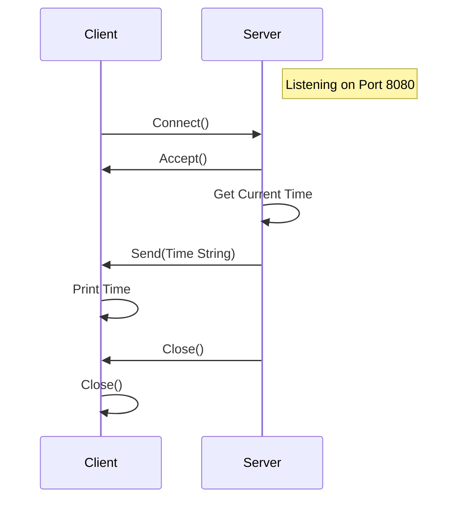
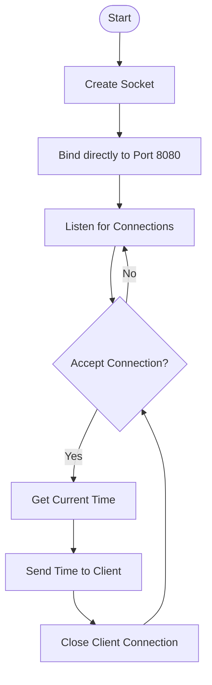
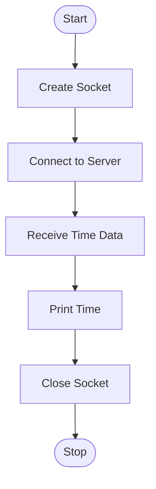

# C Client-Server Date/Time Application

This project implements a simple client-server architecture in C where the client requests the current date and time from the server.

## Overview

- **Server (`server.c`)**: Listens on TCP port 8080. When a client connects, it retrieves the system's current date and time and sends it as a string to the client.
- **Client (`client.c`)**: Connects to the server on `127.0.0.1` (localhost) at port 8080, receives the date/time string, prints it to the standard output, and then exits.

## Diagrams

### Sequence Diagram



### Server Flowchart



### Client Flowchart



## Prerequisites

- GCC compiler (or any standard C compiler)
- Linux/Unix environment (uses `<unistd.h>`, `<sys/socket.h>`, `<arpa/inet.h>`)

## Building

### Using CMake (Recommended)

1.  Create a build directory:
    ```bash
    mkdir -p build && cd build
    ```
2.  Configure and build:
    ```bash
    cmake .. && make
    ```
3.  Run the executables from the `build` directory:
    ```bash
    ./server
    ./client
    ./test_runner
    ```

### Using Make/GCC (Manual)

To compile the source code manually:

```bash
# Compile the server
gcc server.c -o server

# Compile the client
gcc client.c -o client
```

## Usage

1.  **Start the Server:**
    Run the server in a terminal window. It will start listening for incoming connections.
    ```bash
    ./server [-i IP_ADDRESS] [-p PORT]
    ```
    *   `-i IP_ADDRESS`: IP address to bind to (default: `INADDR_ANY` / all interfaces).
    *   `-p PORT`: Port number to listen on (default: 8080).

    Example:
    ```bash
    ./server -p 8081
    ```
    Output:
    ```
    Server listening on ANY:8081
    ```

2.  **Run the Client:**
    Open a new terminal window (or tab) and run the client.
    ```bash
    ./client [-i SERVER_IP] [-p PORT]
    ```
    *   `-i SERVER_IP`: IP address of the server (default: `127.0.0.1`).
    *   `-p PORT`: Port number to connect to (default: 8080).

    Example:
    ```bash
    ./client -p 8081
    ```
    Output:
    ```
    Server time: Mon Feb  9 21:57:35 2026
    ```

## Code Description

### `server.c`
1.  Creates a socket using `socket(AF_INET, SOCK_STREAM, 0)`.
2.  Binds the socket to port 8080 and `INADDR_ANY` using `bind()`.
3.  Listens for connections with `listen()`.
4.  Enters an infinite loop to accept connections using `accept()`.
5.  On connection, gets the current time using `time()` and `localtime()`.
6.  Formats the time using `asctime()` and sends it to the client using `send()`.
7.  Closes the client socket.

### `client.c`
1.  Creates a socket.
2.  Configures the server address struct to connect to `127.0.0.1` on port 8080.
3.  Connects to the server using `connect()`.
4.  Reads the message from the server using `read()`.
5.  Prints the received message.
6.  Closes the socket.
